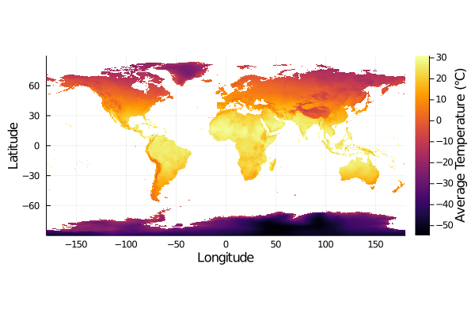

## Simple Layers for Species Distributions Modelling

This package offers very simple types and functions to interact with
bioclimatic data and the output of species distribution models.

  

Curious to know more? Have a look at our [paper in Journal of Open Source Software](https://doi.org/10.21105/joss.02872), our [JuliaCon poster](https://github.com/gabrieldansereau/juliacon-2020-poster/blob/master/juliacon-poster.pdf), our [NextJournal demo notebook](https://nextjournal.com/gabrieldansereau/SimpleSDMLayers-JuliaCon2020-demo/), and our [extended documentation](https://ecojulia.github.io/SimpleSDMLayers.jl/stable/), or keep reading for a quick overview.

### Installation

The currently released version of the package can be installed with:

~~~ julia
] add SimpleSDMLayers
~~~

The package is also designed to work with `GBIF`, so you may want to use the following line instead:

~~~ julia
] add SimpleSDMLayers GBIF
~~~

### Type system

All types belong to the abstract `SimpleSDMLayer`, and are organised in the
same way: a `grid` field storing a matrix of data (of any type!), and the
`left`, `right`, `bottom`, and `top` coordinates (as floating point values).

The two core types of the package are `SimpleSDMPredictor` and
`SimpleSDMResponse`. The only difference between the two is that predictors
are immutable, but responses are.

### Methods

Most of the methods are overloads from `Base`. In particular, `SimpleSDMLayer`
objects can be accessed like normal two-dimensional arrays, in which case
they return an object of the same type if called with a range, and the value
if called with a single position.

It is also possible to crop a layer based on a bounding box:

~~~ julia
p[left=left, right=right, bottom=bottom, top=top]
~~~

If the layer is of the `SimpleSDMResponse` type, it is possible to write to it:
~~~ julia
p[-74.3, 17.65] = 1.4
~~~

This is only defined for `SimpleSDMResponse`, and `SimpleSDMPredictor`
are immutable.

### Bioclimatic data

| Data provider | Dataset                | Layers | Source                             | Future models | Future scenarios             |
| ------------- | ---------------------- | ------ | ---------------------------------- | ------------- | ---------------------------- |
| `EarthEnv`    | `Landcover`            | 12     | [EarthEnv][earthenv-landcover]     |               |                              |
| `EarthEnv`    | `HabitatHeterogeneity` | 14     | [EarthEnv][earthenv-texture]       |               |                              |
| `WorldClim`   | `BioClim`              | 19     | [WorldClim 2.1][worldclim-current] | `CMIP6`       | `SharedSocioeconomicPathway` |
| `CHELSA`      | `BioClim`              | 12     | [CHELSA][chelsa-bioclim]           |               |                              |
 
[earthenv-landcover]: http://www.earthenv.org/landcover
[earthenv-texture]: http://www.earthenv.org/texture
[worldclim-current]: https://www.worldclim.org/data/worldclim21.html
[chelsa-bioclim]: http://chelsa-climate.org/

### Plotting

Using the `Plots` package, one can call the `heatmap`, `contour`, `density`
(requires `StatsPlots`), and `plot` methods. Note that `plot` defaults to a
`heatmap`.

~~~ julia
temperature = SimpleSDMPredictor(WorldClim, BioClim, 1)
plot(temperature)
~~~

  

One can also use `scatter(l1, l2)` where both `l1` and `l2` are layers with the
same dimensions and bounding box, to get a scatterplot of the values. This will
only show the pixels that have non-`nothing` values in *both* layers. Similarly,
`histogram2d` works.

## How to contribute

Please read the [Code of Conduct][CoC] and the [contributing guidelines][contr].

[CoC]: https://github.com/EcoJulia/SimpleSDMLayers.jl/blob/master/CODE_OF_CONDUCT.md
[contr]: https://github.com/EcoJulia/SimpleSDMLayers.jl/blob/master/CONTRIBUTING.md
