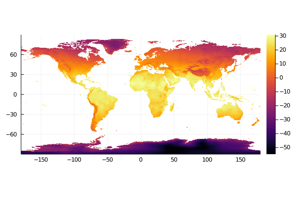
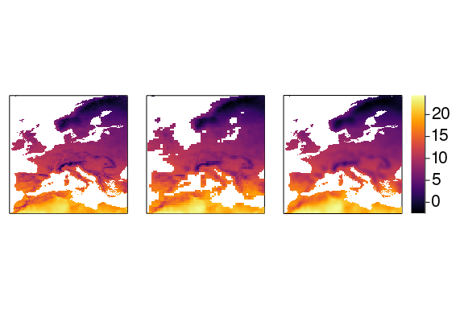
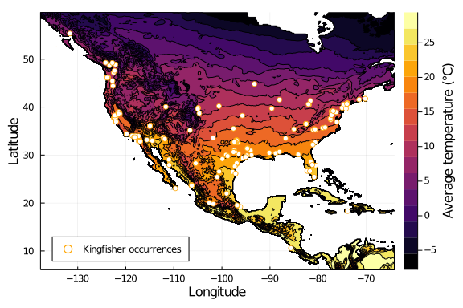

---
affiliations:
  - name: "Département de sciences biologiques, Université de Montréal"
    index: 1
title: |
    SimpleSDMLayers.jl and GBIF.jl: A Framework for Species
    Distribution Modelling in Julia
tags:
  - "Julia"
  - "ecology"
  - "biogeography"
  - "GBIF"
  - "species distribution modelling"
date: "9 September 2020"
authors:
  - name: "Gabriel Dansereau^[Correspondance to gabriel.dansereau@umontreal.ca]"
    orcid: "0000-0002-2212-3584"
    affiliation: 1
  - name: "Timothée Poisot"
    orcid: "0000-0002-0735-5184"
    affiliation: 1
bibliography: "paper.bib"
---


<div style="text-align: justify">

<!-- Text is hard wrapped at 80 characters and after each sentence -->

# Summary

Predicting where species should be found in space is a common question in
Ecology and Biogeography.
Species distribution models (SDMs), for instance, aim to predict where
environmental conditions are suitable for a given species on continuous
geographic scales.
Such analyses require the use of geo-referenced data on species distribution
coupled with climate or land cover informations, hence a tight integration
between environmental data, species occurrence data, and spatial coordinates.
Thus, it requires an efficient way to access species occurrence and
environmental data within the same software, as well as a solid framework on
which to build analyses based on occurrence data.
Here we present `SimpleSDMLayers.jl` and `GBIF.jl`, two packages in the _Julia_
language implementing a framework and type-system on which to build SDM
analyses, as well as providing access to popular data sources for species
occurrence and environmental conditions.

# Statement of need

Species distribution modelling (SDM) is an increasingly growing field in Ecology
and Biogeography, with many applications in biodiversity assessment, management,
and conservation [@ArauAnde19].
Most SDM models aim at predicting a species distribution in space based on
environmental data and information on where the species was previously seen.
Hence, SDM studies require a tight and efficient integration between
geo-referenced environmental and species occurrence data.
However, such data are complex to handle and often require different software:
climate and land use data are stored as layers in raster files, then visualized
and manipulated in specialized GIS (geographic information systems) software,
while occurrence data are stored in tables and spreadsheets sent through data
analysis and statistics-oriented tools or programming languages.
There is therefore a need for efficient tools to manipulate bioclimatic data in
all programming languages, specifically oriented towards species distribution
modelling.

<!-- This kind-of covers the "State of the field" section -->
In recent years, _R_ [@RCo20] has become the most widely used programming
language in Ecology, especially in spatial ecology studies [@LaiLort19].
Hence, many efficient packages and tools for species distribution modelling
have been developed in _R_.
For instance, the package `raster` [@Hijm20] can be used to manipulate raster
format data (for example climatic or land use data), `dismo` [@HijmPhil17]
implements many SDM models and provides access to common climatic data
sources, and `rgbif` [@ChamBarv20] provides access to the GBIF database, a
common source of species occurrence data in SDM studies.
Yet, few SDM resources currently exist for the _Julia_ language [@BezaEdel17],
although its speed and efficiency at numerical computing could be very useful in
SDMs.
There are currently packages such as
[`GDAL.jl`](https://github.com/JuliaGeo/GDAL.jl) and
[`ArchGDAL.jl`](https://github.com/yeesian/ArchGDAL.jl) to manipulate raster
data; however these are lower level implementations than what is typically used
by most ecologists and they support for common layer manipulation features in
SDM studies.

`SimpleSDMLayers.jl` is a package to facilitate manipulation of geo-referenced
raster data in _Julia_, aimed specifically at species distribution modelling.
It is a higher level implementation, building on `ArchGDAL.jl`, that is easier
to use and provides support for common SDM operations.
The package implements simple type structures to manipulate the data, and is
meant to be a flexible framework on which to build complex SDM analyses. 
`SimpleSDMLayers.jl` also offers an built-in access to some of the most common
data sources in SDM studies, such as the WorldClim 2.1 climatic data, which is
the most common source of climate data in SDM studies [@BootNix14].
The package is also tightly integrated with `GBIF.jl`, which allows easy access
to the GBIF database, a common data source for the species occurrences.
Both `SimpleSDMLayers.jl` and `GBIF.jl` are part of the _EcoJulia_ organization,
whose aim is to integrate a variety of packages for ecological analyses in
_Julia_.

# Basic structure

The core structure implemented in the package is the `SimpleSDMLayer` type, with
two variants, `SimpleSDMPredictor` and `SimpleSDMResponse`, depending if the
layer is meant to be mutable or not.

A `SimpleSDMLayer` element is made of a `grid` field, which contains the raster
data as a simple `Array` (matrix) of any type, easily manipulable. 
It also contains the fields `left`, `right`, `bottom` and `top`, representing
the bounding coordinates of the layer. 

To illustrate this structure, the following code loads a layer of WorldClim 2.1
climate data, which also shows how easily this can be done in a single
call.
By default, this will return a layer with the values for the whole world if no
bounding coordinates are specified.

```julia
using SimpleSDMLayers

# Get world temperature data
temperature = worldclim(1)
```

```
SimpleSDMLayers.SimpleSDMPredictor{Float32}(Union{Nothing, Float32}[-31.017
105f0 -31.62153f0 … -32.81253f0 -31.620333f0; -30.391916f0 -31.63478f0 … -3
2.81005f0 -30.995281f0; … ; nothing nothing … nothing nothing; nothing noth
ing … nothing nothing], -180.0, 180.0, -90.0, 90.0)
```


The raster values can be displayed by calling the `grid` field.

```julia
# Display data grid
temperature.grid
```

```
1080×2160 Array{Union{Nothing, Float32},2}:
 -31.0171    -31.6215    -31.6227    …  -32.8129    -32.8125    -31.6203
 -30.3919    -31.6348    -31.6341       -32.8092    -32.8101    -30.9953
 -33.4822    -34.1494    -34.1493       -35.4658    -35.4633    -34.1374
 -33.6104    -34.2875    -34.2865       -35.596     -35.5931    -34.2528
 -33.7199    -34.4041    -34.4014       -35.6932    -35.691     -34.3311
 -33.8224    -34.5184    -34.5162    …  -35.8037    -35.7996    -34.4165
 -31.6613    -32.3194    -32.3184       -33.5133    -33.5101    -32.2032
 -31.7635    -32.4307    -33.7036       -34.9522    -33.6282    -32.3038
 -33.7063    -36.0738    -39.2075       -40.6438    -37.3938    -34.3026
 -33.9768    -34.7016    -35.8662       -37.2408    -36.0364    -34.5988
   ⋮                                 ⋱                          
    nothing     nothing     nothing        nothing     nothing     nothing
    nothing     nothing     nothing        nothing     nothing     nothing
    nothing     nothing     nothing        nothing     nothing     nothing
    nothing     nothing     nothing        nothing     nothing     nothing
    nothing     nothing     nothing  …     nothing     nothing     nothing
    nothing     nothing     nothing        nothing     nothing     nothing
    nothing     nothing     nothing        nothing     nothing     nothing
    nothing     nothing     nothing        nothing     nothing     nothing
    nothing     nothing     nothing        nothing     nothing     nothing
```


`SimpleSDMLayers.jl` then makes it very simple to plot and visualize the layer
as a map using `Plots.jl`.

```julia
using Plots
plot(temperature)
```




# Feature overview

`SimpleSDMLayers.jl` implements the following features: 
- **Overloads for common functions**: The `SimpleSDMLayer` types are implemented
  along with overloads for many common functions and operations, such as
  subsetting, changing values, copying, and iterating. Therefore, the layers and
  the raster values stored in the `grid` field can be manipulated as easily as
  any `Array`, without losing their spatial aspect. 
- **Statistical operations on layer values**: Common operations can be
  performed directly on the layer values without worrying about the underlying
  structure (for example, sum, minimum, maximum, mean, median).
- **Statistical operations on multiple layers**: Operations can also be
  performed between layers to produce a new layer, just as `Arrays`, as long as
  they share the same coordinates. For instance, two layers can be added or
  subtracted, and calling `mean()` will produce a new layer with the mean value
  per pixel.
- **Spatial operations**: `SimpleSDMLayers.jl` implements spatial operations
  such as clipping a layer to given coordinates, coarsening the resolution by
  grouping values, and performing sliding window operations given a certain
  radius.
- **Datasets supported**: The package provides access to climate data
  at different resolutions from WorldClim 2.1 and CHELSA, as well as land cover
  data from EarthEnv. Custom raster data can be loaded as well.
- **Plotting recipes**: Default recipes are implemented for the `SimpleSDMLayer`
  types, allowing to directely map them, view the grid values data as histograms
  and density plots, or compare layers as 2-dimensional histograms.
- **Integration with GBIF.jl (and DataFrames.jl)**: `SimpleSDMLayer.jl` is well
  integrated with `GBIF.jl`, allowing to clip layers based on the occurrence data.
  Both also offer an integration with `DataFrames.jl` to easily convert
  environmental and occurrence data to a table format.

# Examples

### Spatial operations

To illustrate a few of the spatial operations supported by `SimpleSDMLayers.jl`,
the following code reuses the previous `temperature` layer, and shows how it is
possible to : 1) clipping the layer a region of interest (Europe for instance);
2) coarsening the  resolution by averaging groups of cells for large scale
analyses; and 3) performing sliding window operations to aggregate values for
each site based on a certain radius. 
Each of these operations can be performed in a single command and returns new
layers, which can then be plotted.

```julia
using Statistics
# Clip to Europe
temperature_europe = temperature[left = -11.2, right = 30.6, bottom = 29.1, top = 71.0]
# Coarsen resolution
temperature_coarse = coarsen(temperature_europe, Statistics.mean, (4, 4))
# Sliding window averaging
temperature_slided = slidingwindow(temperature_europe, Statistics.mean, 100.0)
```

```
SimpleSDMLayers.SimpleSDMPredictor{Any}(Any[nothing nothing … 20.822838f0 2
0.985363f0; nothing nothing … 20.735191f0 20.890547f0; … ; nothing nothing 
… nothing nothing; nothing nothing … nothing nothing], -11.333333333333334,
 30.666666666666664, 29.0, 71.0)
```





### GBIF integration

As an example of the integration between `SimpleSDMLayers.jl` and `GBIF.jl`,
lets focus on the case of a single species, the Belted Kingfisher (_Megaceryle alcyon_).
`GBIF.jl` first allows us to retrieve the latest occurrences from the GBIF
database.

```julia
using GBIF
kingfisher = GBIF.taxon("Megaceryle alcyon", strict=true)
kf_occurrences = occurrences(kingfisher)
# Get at least 200 occurrences
while length(kf_occurrences) < 200
    occurrences!(kf_occurrences)
    @info "$(length(kf_occurrences)) occurrences"
end
kf_occurrences
```

```
GBIF records: downloaded 200 out of 100000
```


Then, `SimpleSDMLayers.jl` integrates this data and can combine it with the
environmental layers, allowing to clip the layers to the extent of the
occurrences.
Finally, it is very straightforward to create a map of the occurrences by
overlaying them on top of the environmental data.

```julia
# Clip layer to occurrences
temperature_clip = clip(temperature, kf_occurrences)

# Plot occurrences
contour(temperature_clip, fill=true, colorbar_title = "Average temperature (°C)",
                  xguide = "Longitude", yguide = "Latitude")
scatter!(longitudes(kf_occurrences), latitudes(kf_occurrences), 
         label = "Kingfisher occurrences", legend = :bottomleft, 
         c = :white, msc = :orange)
```




# Acknowledgements


# References